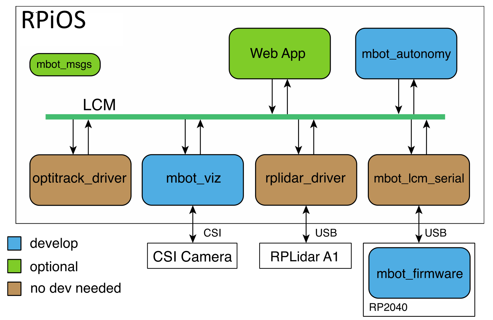
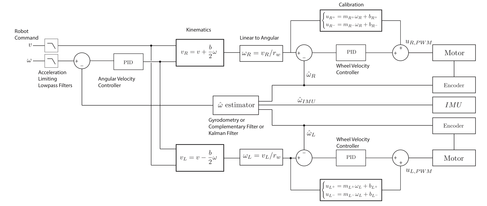
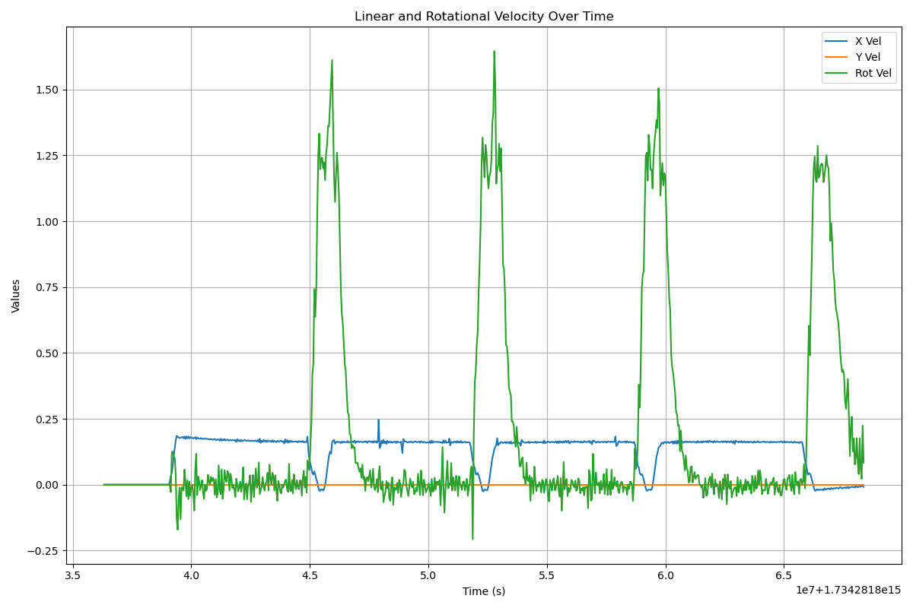
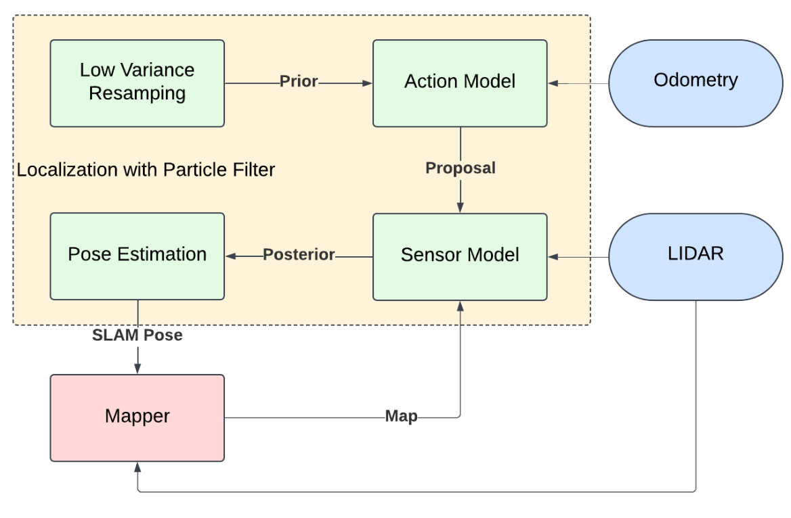
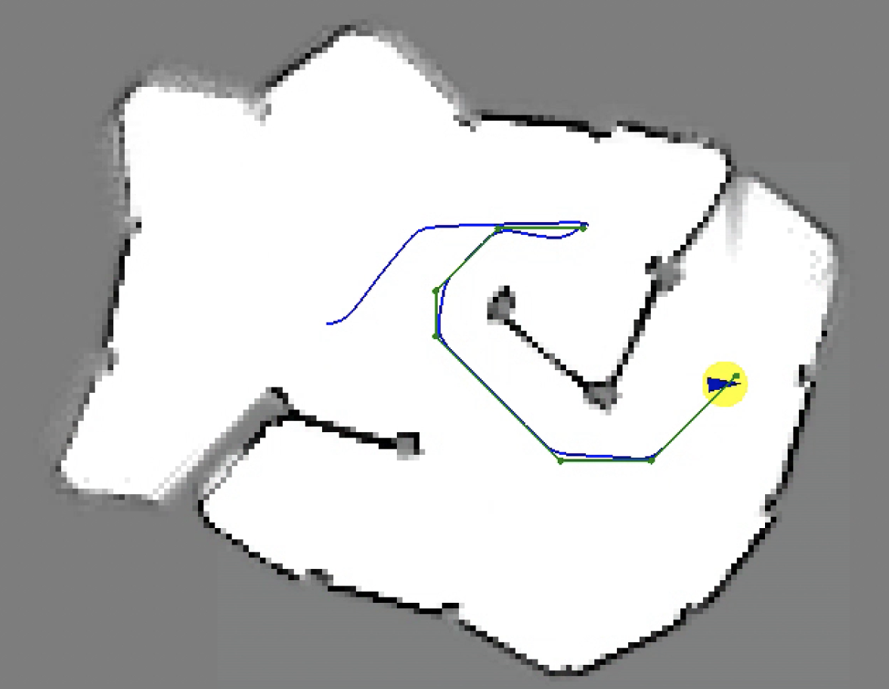

# BotLab
BotLab is a course project for the University of Michigan's ROB550 - Robotic Systems Lab. This project presents an autonomous mobile robot system implemented on the differential drive MBot platform equipped with 2D LIDAR, wheel encoders, an IMU, and a camera. The system achieves precise motion control using PID feedback and a carrot-following algo- rithm, robust mapping via particle filter-based SLAM with occupancy grids, and autonomous exploration through A* path planning and frontier-based strategies. Additionally, a YOLO model was trained to detect cones and blocks for task execution. This work achieved first place in the final competition of the class.

*Speed Run*

*Exploring an unknown map and return to the initial pose*

*Localize the pose in a random location*

## Software
The software structure is built on the RPiOS system, using **LCM** for inter-process communication. It integrates modules for data acquisition, control, and visualization. Key components include:

- **Sensors**: CSI Camera (handled by `mbot_viz`), RPLidar A1 (`rplidar_driver`), and Optitrack (`optitrack_driver`).
- **Control**: `mbot_firmware` (on RP2040) and `mbot_lcm_serial` for serial communication.
- **Autonomy**: `mbot_autonomy` for decision-making and navigation.
- **GUI**: A Web App for monitoring and `mbot_msgs` for message definitions.

## Firmware Control
The motor control system integrates feedforward and feedback components to achieve precise velocity tracking. The linear velocity and angular velocity are converted into individual wheel velocities using kinematic equations. Feedforward PWM values are calculated based on calibration equations, while odometry data provides actual wheel velocities for feedback control. A PID controller minimizes velocity errors by compensating for mismatches in both overall velocity and individual wheel velocities. The final PWM input combines feedforward and feedback components, ensuring stable and accurate motor control across the robot's operating range.

## Motion Control
The high-level motion control system implements a control strategy for waypoint navigation. Carrot- following algorithm was used as motion controller be- cause it can follow the waypoints more smooth and effective. It is designed to guide the robot toward a "carrot" point, which dynamically adjusts based on the robot’s current position and a lookahead distance.

*The linear velocity is constant over time.*

## SLAM
The SLAM framework consists of a mapping module for environment representation and a localization module that uses particle filtering with an action and sensor model to estimate the robot’s position.

- **Mapping**: The mapping subsystem uses an occu- pancy grid representation with a log-odds framework to model the environment accurately.
- **Particle Filter**:  the previous set of particles `posterior` is first resampled using the low variance sampling, transforming them into the new `prior`. Next, the action model is applied to generate the distributed particles `proposal`. Subsequently, the sensor model is used to compute the weight of each particle, updating the `posterior`. Finally, the robot’s SLAM pose is estimated based on the updated `posterior`.

## Path Planning
Path planning implementation utilizes an A* search algorithm enhanced with obstacle distance constraints for safe and efficient trajectory gen- eration.

